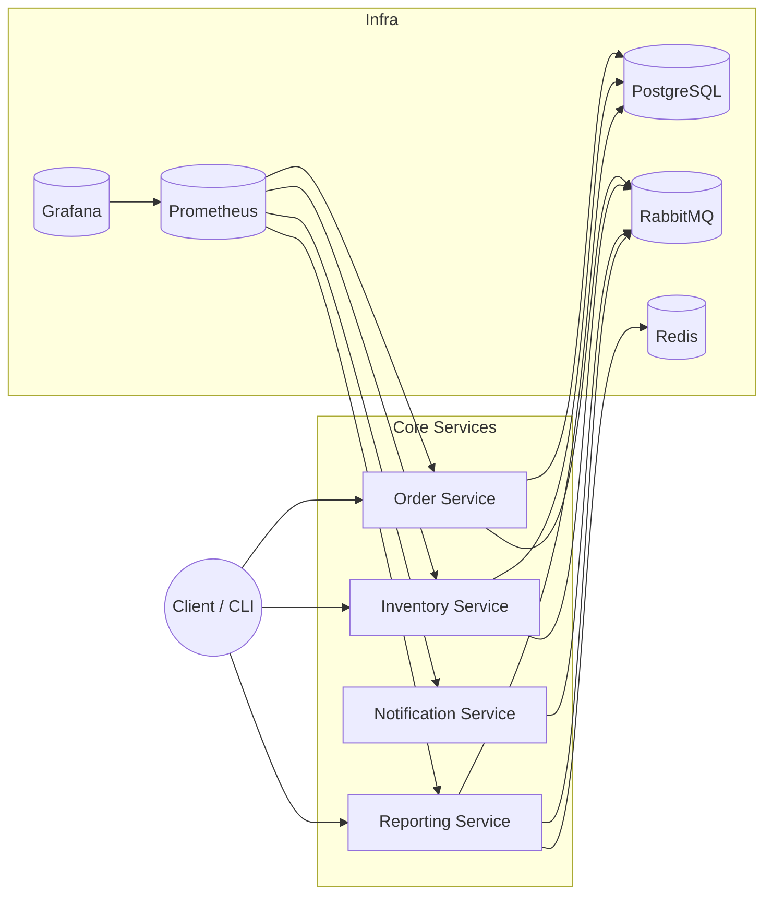

# Real-Time Order System - Technical Analysis and Boundaries

Turkish version: `technical-boundaries.tr.md`.

This document summarizes RTOS technical scope, architecture, dependencies, and operational boundaries in one place. The goal is to give new team members a fast, accurate understanding and provide a reference for demos and operations.

## 1) Purpose and Scope
- **Purpose:** Demonstrate real-time order processing, event-driven service communication, and a reporting pipeline.
- **Scope:** Order, Inventory, Notification, Reporting services; Postgres, RabbitMQ, Redis, Prometheus, Grafana.
- **Out of scope:** Payments/charging, shipping/fulfillment, external provider integrations, API gateway/WAF, production-scale hardening.

## 2) System Overview and Main Flow
1. A client submits an order via REST (JWT) to the Order service.
2. Order data is stored in Postgres; an outbox event record is created in the same transaction.
3. OutboxRelay publishes `order.created.v1` to the RabbitMQ `order.events` exchange.
4. Inventory and Notification consume the event; Inventory updates reservations idempotently.
5. Reporting consumes `order.created.v1`, updates rollup + snapshot tables, and serves reports.
6. When an order status changes, `order.status-changed.v1` is produced; Inventory and Notification consume it.

### Architecture Diagram

## 3) Architecture and Service Responsibilities
| Service | Port | Responsibility |
|---|---:|---|
| Order | 8081 | Order CRUD, outbox event production |
| Notification | 8082 | Event consumption, example notification flow |
| Inventory | 8083 | Stock reservation, idempotent consumption |
| Reporting | 8084 | Reporting, rollups/snapshots, CSV export |

All services are built with Java 17 + Spring Boot 3.5.5 + Maven; metrics are collected via Micrometer.

**Infrastructure services:** PostgreSQL (5432), RabbitMQ (5672/15672), Redis (6379), Prometheus (9090), Grafana (3000).

## 4) Data and Messaging Boundaries
- **Postgres:** Single DB (`appdb`); Flyway migrations managed per service.
- **Order tables:** `orders`, `order_items`, `outbox_events`.
- **Reporting tables:** `report_order_rollup_daily`, `report_snapshots`, `report_message_log`.
- **Messaging:** `order.events` exchange; routing keys `order.created.v1`, `order.status-changed.v1`.
- **Consumption scope:** Reporting consumes only `order.created.v1`; Inventory/Notification consume both.
- **Queues (dev):** `dev.reporting.order-created` (+ `.dlq`), `dev.inventory.order-created` / `dev.inventory.order-status-changed` (+ `.retry`, `.dlq`), `dev.notifications.order-created` / `dev.notifications.order-status-changed` (+ `.dlq`).

## 5) Reliability and Resilience
- **Outbox pattern:** Events are persisted in DB; `OutboxRelay` publishes periodically (at-least-once).
- **Manual ACK + idempotency:** Inventory and Reporting dedupe via message log tables (`inventory_message_log`, `report_message_log`) and ACK on success.
- **Retry/DLQ:** Inventory uses retry TTL before DLQ; Reporting/Notification use DLQ; replay is supported via ops endpoints.

## 6) Performance and Cache
- Reporting `totals` and `top-customers` responses are cached.
- Provider: `caffeine` (app default) or `redis` (deploy `.env` default).
- Defaults: TTL 60s, max 500 entries; override with `APP_REPORTING_CACHE_TTL`, `APP_REPORTING_CACHE_MAX_SIZE`.

## 7) Security and Access
- JWT is required on all services (Actuator health is public).
- Shared `common-security` module; issuer `rtos`, audience `rtos-clients`.
- Roles: `ROLE_ORDER_*`, `ROLE_INVENTORY_*`, `ROLE_REPORTING_*`.
- The dev token is printed in logs and expires.

## 8) Observability and Operations
- **Metrics:** Micrometer -> Prometheus -> Grafana (scrapes `/actuator/prometheus`).
- **Grafana dashboards:** `rtos-services`, `reporting-overview`.
- **Critical metrics:** `reporting_orders_processed_total`, `reporting_order_processing_latency_seconds_bucket`, `reporting_last_order_timestamp_seconds`, `rabbitmq_queue_messages_ready{queue="dev.reporting.order-created"}`, `order_outbox_dispatch_total{result}`, `order_outbox_pending_events`.
- **Alerts:** service down, p95 latency increase, staleness, queue backlog.

## 9) Run Modes
- **Docker Compose (recommended):** All services + infra in one flow.
- **Local JVM:** Infra in Compose; services via IntelliJ/Spring Boot.
- Details: `docs/setup/running.md`, `docs/setup/runtime-technical.md`.

## 10) Boundaries, Assumptions, and Risks
- Single Postgres is sufficient for now; splitting per service is a future step.
- CI/CD and Kubernetes orchestration are not in place yet.
- Cache tuning and consumer scaling will be needed as traffic grows.
- DLQ cleanup and archival automation are out of scope.

## 11) References
- Overview: `README.md`
- Technical deep dive: `docs/overview/project-deep-dive.md`
- Demo/slide flow: `docs/overview/presentation-guide.md`
- Reporting details: `docs/reporting/requirements.md`, `docs/reporting/runbook.md`
- Container standards: `docs/containerization/baseline.md`
- Test flows: `docs/testing/manual-happy-path.md`
