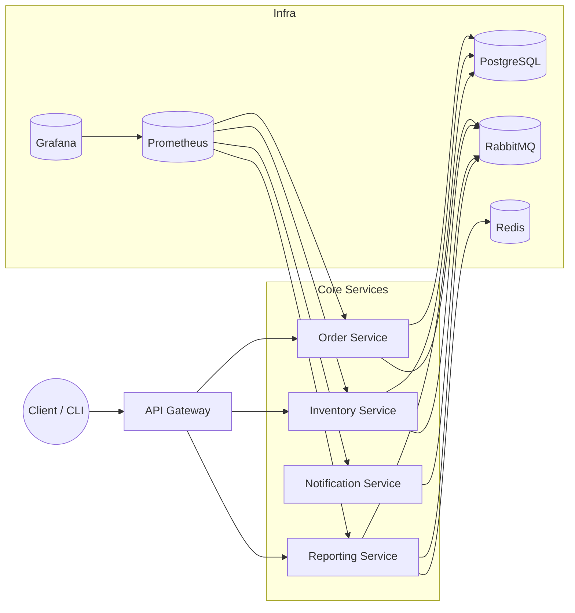

# Real-Time Order System - Teknik Analiz ve Sınırlar

English version: `technical-boundaries.md`.

Bu doküman, RTOS'un teknik kapsamını, mimarisini, bağımlılıklarını ve operasyonel sınırlarını tek yerde özetler. Hedef, yeni ekip üyelerine hızlı ve doğru bir resim sunmak ve demo/operasyon için referans vermektir.

## 1) Amaç ve Kapsam
- **Amaç:** Gerçek zamanlı sipariş işleme, olay tabanlı servis iletişimi ve raporlama hattını göstermek.
- **Kapsam:** API Gateway; Order, Inventory, Notification, Reporting servisleri; Postgres, RabbitMQ, Redis, Prometheus, Grafana.
- **Kapsam dışı:** Ödeme/tahsilat, sevkiyat/fulfillment, dış sağlayıcı entegrasyonları, WAF, prod ölçeği.

## 2) Sistem Özeti ve Ana Akış
1. İstemci REST (JWT) ile API Gateway üzerinden Order servisine sipariş gönderir.
2. Order verisi Postgres'e yazılır; aynı transaction içinde outbox event kaydı oluşturulur.
3. OutboxRelay, RabbitMQ `order.events` exchange'ine `order.created.v1` publish eder.
4. Inventory ve Notification olayı tüketir; Inventory rezervasyonları idempotent şekilde günceller.
5. Reporting `order.created.v1` tüketir, rollup + snapshot tablolarını günceller ve raporları sunar.
6. Order durumu değiştiğinde `order.status-changed.v1` üretilir; Inventory ve Notification tüketir.

### Mimari Diyagram

## 3) Mimari ve Servis Sorumlulukları
| Servis | Port | Sorumluluk |
|---|---:|---|
| API Gateway | 8080 | JWT dogrulama, routing, rate limiting, request validation |
| Order | 8081 | Sipariş CRUD, outbox event üretimi |
| Notification | 8082 | Olay tüketimi, örnek bildirim akışı |
| Inventory | 8083 | Stok rezervasyonu, idempotent tüketim |
| Reporting | 8084 | Raporlama, rollup/snapshot, CSV export |

Tüm servisler Java 17 + Spring Boot 3.5.5 + Maven ile geliştirilir; metrikler Micrometer ile toplanır.

**Altyapı servisleri:** PostgreSQL (5432), RabbitMQ (5672/15672), Redis (6379), Prometheus (9090), Grafana (3000).

## 4) Veri ve Mesajlaşma Sınırları
- **Postgres:** Tek DB (`appdb`); Flyway migration'ları servis bazında yönetilir.
- **Order tabloları:** `orders`, `order_items`, `outbox_events`.
- **Reporting tabloları:** `report_order_rollup_daily`, `report_snapshots`, `report_message_log`.
- **Mesajlaşma:** `order.events` exchange; routing key'ler `order.created.v1`, `order.status-changed.v1`.
- **Tüketim kapsamı:** Reporting yalnızca `order.created.v1`; Inventory/Notification her ikisini tüketir.
- **Kuyruklar (dev):** `dev.reporting.order-created` (+ `.dlq`), `dev.inventory.order-created` / `dev.inventory.order-status-changed` (+ `.retry`, `.dlq`), `dev.notifications.order-created` / `dev.notifications.order-status-changed` (+ `.dlq`).

## 5) Güvenilirlik ve Dayanıklılık
- **Outbox pattern:** Olaylar DB'de kalıcıdır; `OutboxRelay` periyodik publish eder (at-least-once).
- **Manual ACK + idempotency:** Inventory ve Reporting message log tabloları (`inventory_message_log`, `report_message_log`) ile tekrarları ayıklar, başarı sonrası ACK eder.
- **Retry/DLQ:** Inventory retry TTL ile DLQ öncesi deneme yapar; Reporting/Notification DLQ kullanır; ops endpoint'leriyle replay desteklenir.

## 6) Performans ve Cache
- Reporting `totals` ve `top-customers` cevapları cache'lenir.
- Provider: `caffeine` (app default) veya `redis` (deploy `.env` default).
- Varsayılanlar: TTL 60s, max 500 kayıt; `APP_REPORTING_CACHE_TTL`, `APP_REPORTING_CACHE_MAX_SIZE` ile override edilir.

## 7) Güvenlik ve Erişim
- Tüm servislerde JWT zorunlu (Actuator health public).
- Ortak `common-security` modülü; issuer `rtos`, audience `rtos-clients`.
- Roller: `ROLE_ORDER_*`, `ROLE_INVENTORY_*`, `ROLE_REPORTING_*`.
- Dev token log'larda basılır ve sürelidir.

## 8) Observability ve Operasyon
- **Metrikler:** Micrometer -> Prometheus -> Grafana (`/actuator/prometheus` scrape edilir).
- **Grafana dashboard'ları:** `rtos-services`, `reporting-overview`.
- **Kritik metrikler:** `reporting_orders_processed_total`, `reporting_order_processing_latency_seconds_bucket`, `reporting_last_order_timestamp_seconds`, `rabbitmq_queue_messages_ready{queue="dev.reporting.order-created"}`, `order_outbox_dispatch_total{result}`, `order_outbox_pending_events`.
- **Alertler:** servis down, p95 latency artışı, staleness, kuyruk backlog.

## 9) Çalıştırma Modları
- **Docker Compose (önerilen):** Tüm servisler + altyapı tek akışta.
- **Local JVM:** Altyapı Compose'ta; servisler IntelliJ/Spring Boot ile.
- Ayrıntılar: `docs/setup/running.md`, `docs/setup/runtime-technical.md`.

## 10) Sınırlar, Varsayımlar ve Riskler
- Tek Postgres şimdilik yeterli; servis başına DB ayrıştırma gelecekte.
- CI/CD ve Kubernetes orkestrasyonu henüz yok.
- Trafik arttıkça cache tuning ve tüketici ölçekleme gerekir.
- DLQ cleanup ve arşivleme otomasyonu kapsam dışıdır.

## 11) Referanslar
- Genel bakış: `README.md`
- Teknik derinleşme: `docs/overview/project-deep-dive.md`
- Demo/slide akışı: `docs/overview/presentation-guide.md`
- Raporlama detayları: `docs/reporting/requirements.md`, `docs/reporting/runbook.md`
- Container standartları: `docs/containerization/baseline.md`
- Test akışları: `docs/testing/manual-happy-path.md`
