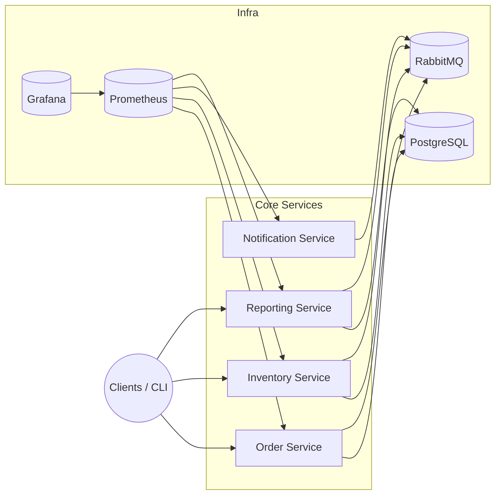

# Real-Time Order System – Teknik Derinlemesine İnceleme

Bu belge, projeyi uçtan uca anlamanı kolaylaştırmak için hazırlanmıştır. Aşağıda mimariden kullanılan teknoloji stack’ine, izlenen fazlardan operasyonel süreçlere kadar her bölüm öğretici bir biçimde ele alınmıştır.

---

## 1. Projenin Amacı

- **Gerçek zamanlı sipariş işleme:** Order servisinin REST API’si üzerinden gelen talepler anında PostgreSQL’e yazılır ve Outbox deseni ile mesaj kuyruğuna taşınır.
- **Olay tabanlı mimari:** RabbitMQ üzerinde `order.events` exchange’i aracılığıyla diğer servisler (Inventory, Notification, Reporting) anlık olarak tetiklenir.
- **Operasyonel şeffaflık:** Prometheus + Grafana ile tüm servislerin metrikleri izlenir, uyarı kuralları (latency, staleness, queue backlog vb.) otomatik devreye girer.
- **Analitik raporlama:** Reporting servisi RabbitMQ’dan gelen olayları tüketir, rollup + snapshot yapısını günceller ve REST/CSV export endpoint’leri üzerinden dashboard’lara veri sağlar.
- **Taşınabilirlik:** Docker Compose ve standartlaştırılmış Dockerfile’lar sayesinde yerel ortamdan sunucuya kadar aynı build/run süreci izlenir. İleride Kubernetes/Minikube ile orkestrasyon genişletilecek.

---

## 2. Mimarinin Genel Görünümü

### Servis Bazında Özet

| Servis | Ana Teknolojiler | Görev |
|--------|------------------|-------|
| Order | Spring Boot, PostgreSQL, RabbitMQ, Flyway, Micrometer | Sipariş CRUD, **Outbox + Rabbit** publisher |
| Inventory | Spring Boot, PostgreSQL, RabbitMQ | Stok güncelleme, rezervasyon süreçleri |
| Notification | Spring Boot, RabbitMQ | Dummy e-posta/SMS/push bildirim tüketicisi |
| Reporting | Spring Boot, PostgreSQL, RabbitMQ, Caffeine Cache | Günlük/haftalık/aylık raporlar + CSV export |

---

## 3. İzlenen Fazlar ve Çıktıları

### 3.1 Çekirdek Servisler (Order / Inventory / Notification)
- Spring Boot 3.5, Maven ve Flyway kullanılarak domain odaklı servisler kuruldu.
- Outbox pattern ile Order servisinden çıkan olayların güvenilir şekilde RabbitMQ’ya iletilmesi sağlandı.

### 3.2 Güvenlik
- `backend/common-security` modülü JWT doğrulaması, `JwtAuthenticationFilter`, `JwtAuthenticationEntryPoint` ve role tanımları (`Roles.java`) içerir.
- Her serviste `SecurityConfig` ve method-level @PreAuthorize anotasyonlarıyla RBAC uygulanır.

### 3.3 Raporlama (Nov 22 – Dec 5 fazı)
- `reporting-service`:
  - RabbitMQ dinleyicisi (`OrderEventsListener`) ile mesaj log’u ve rollup tabloları güncellenir.
  - `ReportService` Caffeine cache ile totals/top-customers sonuçlarını 60 sn boyunca saklar.
  - REST API + CSV exporter + refresh endpoint’leri güvenlik rollerine göre ayrılır (`ROLE_REPORTING_READ`, `ROLE_REPORTING_EXPORT`).
  - Dashboard + runbook + requirements dökümanları: `docs/reporting/*`.

### 3.4 Containerization & Observability
- Tüm servis Dockerfile’ları tek bir baseline’a çekildi: multi-stage build, non-root user, healthcheck, OCI metadata (`docs/containerization/baseline.md`).
- Build/push/rollback süreci `docs/containerization/release.md` ile belgelendi.
- Prometheus scrape config’ine reporting servisi eklendi, `deploy/observability/alerts.yml` ile servis down/latency/staleness/backlog alarmları tanımlandı.
- Grafana dashboards (`deploy/observability/dashboards`) + provisioning (datasource/dashboards yaml) devrede.

---

## 4. Teknoloji Stack’i

| Katman | Teknoloji / Araç | Açıklama |
|--------|------------------|----------|
| Backend | Java 17, Spring Boot 3.5, Maven | Mikroservisler |
| Veri Tabanı | PostgreSQL + Flyway | Persistans ve şema yönetimi |
| Mesajlaşma | RabbitMQ, Spring AMQP | Event-driven iletişim |
| Cache | Caffeine (Reporting) | Totals/top-customers caching |
| Güvenlik | JWT, Spring Security | Ortak `common-security` modülü |
| Konteyner | Docker, Docker Compose | Çok aşamalı build + healthcheck |
| Observability | Micrometer, Prometheus, Grafana | Metrikler, paneller, alert kuralları |
| Dokümantasyon | Markdown (docs/*) | Requirements, runbook, release, setup rehberleri |

---

## 5. Süreç Yönetimi ve Geliştirme Yaklaşımı

- **Branch/Commit stratejisi:** Kodlar lokal olarak test edildikten sonra `main` branch’ine gönderilmeye hazır hale getiriliyor. (CI/CD fazı sonraki sprintte ele alınacak.)
- **Test yaklaşımı:** Her servis için `mvn -pl <service> -am test` komutları çalıştırılıyor. Mockito + Spring Boot testleri ile API güvenliği ve servis mantığı doğrulanıyor.
- **Performans doğrulaması:** `docs/reporting/runbook.md` ve `docs/setup/runtime-technical.md` içinde yer alan senaryolarla load, latency ve queue backlog gözlemleniyor.

---

## 6. Runtime & Observability Detayları

### 6.1 Docker Compose Flow
1. `cd deploy && docker compose up -d postgres rabbitmq prometheus grafana`
2. `docker compose build order-service ... reporting-service`
3. `docker compose up -d order-service ... reporting-service`
4. Aktiflik kontrolü: `curl http://localhost:8084/actuator/health`
5. Grafana: `http://localhost:3000` (şifre `GF_SECURITY_ADMIN_*` değişkenleriyle tanımlanır; varsayılan `admin`/`admin`), “Reporting Overview” dashboard’u.
6. Prometheus alertleri: `http://localhost:9090/alerts`.

### 6.2 IntelliJ/Spring Boot Run
1. Projeyi Maven olarak import et.
2. `.env` içindeki değerler için Run Configuration → Environment Variables alanını doldur.
3. Her servis için Spring Boot run konfigürasyonu oluştur ve `SPRING_PROFILES_ACTIVE=dev` set et.
4. Rabbit/Postgres konteynerleri Compose ile çalıştırılmaya devam eder (yalnızca app’ler local JVM’de).

### 6.3 Ana Metrikler
- `reporting_orders_processed_total`
- `reporting_order_processing_latency_bucket`
- `reporting_order_amount_cents_sum`
- `reporting_last_order_timestamp_seconds`
- `rabbitmq_queue_messages_ready{queue="dev.reporting.order-created"}`

### 6.4 Alert Kuralları (deploy/observability/alerts.yml)
| Alert | Koşul | Önemi | Aksiyon |
|-------|-------|--------|---------|
| ReportingServiceDown | `up==0` 1 dk | Critical | Container/log incele, yeniden başlat |
| ReportingProcessingLatencyHigh | p95 >2s 2 dk | Warning | Rabbit backlog + DB load kontrolü |
| ReportingStalenessHigh | 5 dk yeni event yok | Critical | Rabbit bağlantısı, refresh tetikle |
| ReportingQueueBacklog | Ready mesaj >100 5 dk | Warning | Tüketici ölçekle, DLQ’yu boşalt |

---

## 7. Sonuç ve Öğrenilenler

- **Event-driven + Outbox** yaklaşımı veri tutarlılığını sağladı.
- **RBAC + JWT** sayesinde servisler arası güvenli erişim sağlandı.
- **Reporting modülü**: Rollup/Snapshot + Caffeine cache + CSV export ile operasyonel raporlama ihtiyacı karşılandı.
- **Container Baseline** projeyi prod’a hazır hale getiren en kritik adımdı: non-root kullanıcı, healthcheck, multi-stage build.
- **Observability**: Prometheus/Grafana + alert kuralları projenin “yaşayan” metriklerini izlenebilir kıldı.

Bu belgeyi tamamladığında, projenin ne yaptığı, hangi teknolojileri nasıl kullandığı ve işletim açısından nasıl yönetileceği konusunda net bir fikir edinmiş olman gerekir. Detaylı komutlar ve diyagramlar için referans bağlantıları README’de listelenmiştir. Soruların olursa veya belirli bir fazın daha derin anlatımını istersen hemen haber ver!
- **Order Outbox & Messaging (Phase 2-3 köprüsü):**
  - Outbox tablosu (`V4__outbox_events.sql`) ORM entity/repository ile yönetiliyor.
  - `OutboxOrderEventPublisher` domain olaylarını JSON payload’a çevirerek outbox’a yazar; `OutboxRelay` scheduler’ı RabbitMQ’ya gönderir.
  - Micrometer metrikleri: `order_outbox_dispatch_total{result}` ve `order_outbox_pending_events` gauge’i Prometheus’ta izlenebilir.
