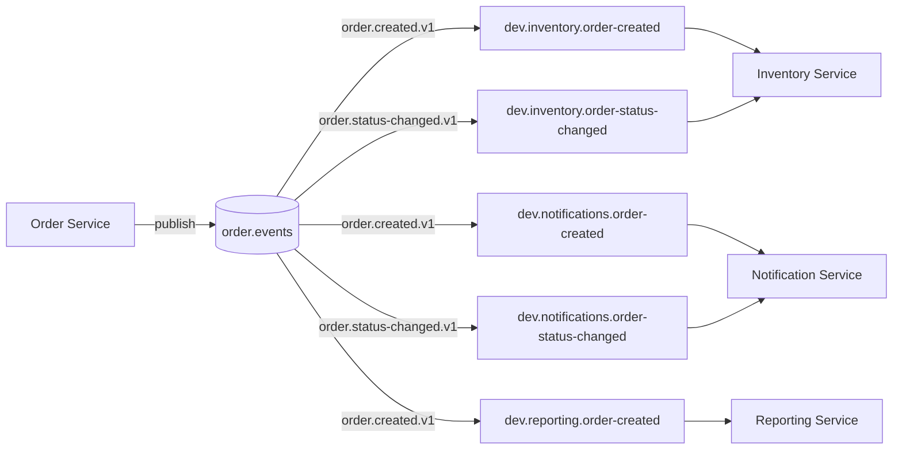
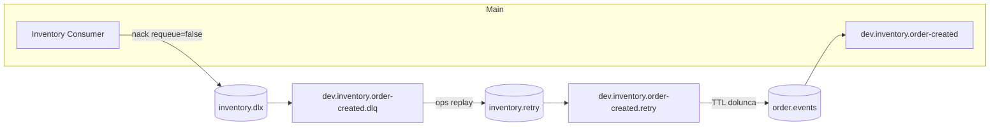

# RabbitMQ Dokumantasyonu (Genel + Proje Rehberi)

Bu belge iki hedefi bir arada tutar:
- RabbitMQ'yu genel olarak iyi kavraman (kavramlar, pattern'lar, garanti seviyesi)
- Bu projede RabbitMQ'nun nasil kullanildigini kod ve konfigurasyonla ogrenmen

Odak: event-driven akislar, dayaniklilik (outbox + DLQ + retry), manuel ack ve operasyon/observability.

---

## 1) RabbitMQ Temel Kavramlar (Kisa, net)

**Broker**: RabbitMQ sunucusunun kendisi. Ureten (producer) ve tuketen (consumer) arasindaki mesajlasma omurgasi.

**Exchange**: Mesajlari routing key ve binding'lere gore kuyruklara dagitir.
- **direct**: routing key bire bir eslesir.
- **topic**: `order.created.*` gibi wildcard ile eslesir.
- **fanout**: routing key'e bakmadan tum bagli kuyruklara gider.
- **headers**: header bazli routing.

**Queue**: Mesajin durdugu yer. Consumer buradan okur.

**Binding**: Exchange ile Queue arasindaki bag. Routing key burada onem kazanir.

**Ack / Nack**:
- **Ack**: "mesaji isledim".
- **Nack**: "basarisiz" (requeue false ise DLQ'ya gider).

**DLQ (Dead Letter Queue)**: Islenemeyen mesajlarin biriktigi kuyruk.

**TTL (Time-To-Live)**: Mesajin/queue'nun yasam suresi. Retry icin sik kullanilir.

**At-least-once teslim**: Mesaj birden fazla gorulebilir. O yuzden **idempotency** kritik.

---

## 2) Bu Projede RabbitMQ Neden Var?

Order servisinden cikan olaylarin (order.created, order.status-changed) baska servisleri gercek zamanli tetiklemesi icin.

Projedeki temel hedefler:
- **Gevsek baglilik**: Order servisi, Inventory/Notification/Reporting servislerini dogrudan cagirmiyor.
- **Dayaniklilik**: Outbox deseni ile event kaybi minimize ediliyor.
- **Kontrollu hata yonetimi**: DLQ ve retry akislari ile operasyonel kontrol saglaniyor.

---

## 3) Projede Kullanilan RabbitMQ Topolojisi

### 3.1 Olay Akisi (High-level)



### 3.2 Retry + DLQ (Inventory ornegi)



---

## 4) RabbitMQ Kaynaklari (Projedeki Gercek Isimler)

### 4.1 Exchange'ler
- `order.events` (topic) - tum order event'lerinin ana exchange'i
- `order.dlx` (topic) - notification DLQ routing
- `inventory.retry` (topic) - inventory retry akisi
- `inventory.dlx` (topic) - inventory DLQ
- `reporting.dlx` (topic) - reporting DLQ

Kaynak: `deploy/rabbitmq/definitions.json`

### 4.2 Queue'lar
**Inventory**
- `dev.inventory.order-created`
- `dev.inventory.order-created.retry`
- `dev.inventory.order-created.dlq`
- `dev.inventory.order-status-changed`
- `dev.inventory.order-status-changed.retry`
- `dev.inventory.order-status-changed.dlq`

**Notification**
- `dev.notifications.order-created`
- `dev.notifications.order-created.dlq`
- `dev.notifications.order-status-changed`
- `dev.notifications.order-status-changed.dlq`

**Reporting**
- `dev.reporting.order-created`
- `dev.reporting.order-created.dlq`

Kaynak: `deploy/rabbitmq/definitions.json`

### 4.3 Routing Key'ler
- `order.created.v1`
- `order.status-changed.v1`
- Retry: `<routingKey>.retry`
- DLQ: `<routingKey>.dlq`

Kaynak: `backend/*/src/main/resources/application.yml`

---

## 5) Mesaj Formati (Gercek Payload)

Order servisi uzerinden publish edilen payload tipik olarak:

```json
{
  "type": "order.created.v1",
  "eventId": "uuid",
  "id": 123,
  "customerId": "C-1001",
  "amountCents": 1999,
  "currency": "TRY",
  "items": [
    { "sku": "ABC-001", "qty": 1 }
  ]
}
```

Ek olarak header'lar:
- `messageId` (AMQP standard header)
- `x-event-id` (opsiyonel, idempotency icin)

---

## 6) Koddan Ornekler (Gercek Proje Kodlari)

### 6.1 Publisher (Order Service)
Kaynak: `backend/order-service/src/main/java/com/hacisimsek/orders/messaging/RabbitOrderEventPublisher.java`

```java
rabbit.convertAndSend(props.exchange(), props.routingKeys().orderCreated(), payload, msg -> {
    msg.getMessageProperties().setMessageId(eventId);
    msg.getMessageProperties().setHeader("x-event-id", eventId);
    return msg;
});
```

### 6.2 Outbox Pattern (Persist + Relay)
Kaynak: `backend/order-service/src/main/java/com/hacisimsek/orders/messaging/OutboxOrderEventPublisher.java`

```java
var event = new OutboxEvent(eventId, aggregateId, aggregateType, type, exchange, routingKey, serialized);
repository.save(event);
```

Kaynak: `backend/order-service/src/main/java/com/hacisimsek/orders/outbox/OutboxRelay.java`

```java
@Scheduled(fixedDelayString = "${app.outbox.poll-interval:1s}")
@Transactional
public void publishPending() {
    List<OutboxEvent> batch = repository.findByStatusOrderByCreatedAtAsc(
            OutboxStatus.PENDING, PageRequest.of(0, props.getBatchSize()));
    batch.forEach(this::publishSingle);
}

rabbitTemplate.convertAndSend(event.getExchange(), event.getRoutingKey(), message, msg -> {
    msg.getMessageProperties().setMessageId(event.getEventId());
    msg.getMessageProperties().setHeader("x-event-id", event.getEventId());
    return msg;
});
```

### 6.3 Consumer (Inventory) - Manual Ack + Idempotency
Kaynak: `backend/inventory-service/src/main/java/com/hacisimsek/inventory/messaging/OrderEventsListener.java`

```java
@RabbitListener(queues = "${app.messaging.queues.orderCreated}", containerFactory = "manualAckContainerFactory")
public void onOrderCreated(Map<String,Object> payload, Channel ch,
                           @Header(AmqpHeaders.DELIVERY_TAG) long tag,
                           @Header(value = AmqpHeaders.MESSAGE_ID, required = false) String msgId,
                           @Header(value = "x-event-id", required = false) String xEventId) throws Exception {
    String effectiveId = firstNonNull(msgId, xEventId, (String) payload.get("eventId"));
    try {
        idempotency.processOnce(effectiveId, () -> { /* domain logic */ });
        ch.basicAck(tag, false);
    } catch (Exception e) {
        ch.basicNack(tag, false, false);
    }
}
```

### 6.4 Retry + DLQ (Inventory Queue Deklarasyonlari)
Kaynak: `backend/inventory-service/src/main/java/com/hacisimsek/inventory/config/AmqpConfig.java`

```java
Queue orderCreatedRetryQ(AmqpProps p){
    return QueueBuilder.durable(p.queues().orderCreated() + ".retry")
            .withArgument("x-message-ttl", retryTtlMs)
            .withArgument("x-dead-letter-exchange", p.exchange())
            .withArgument("x-dead-letter-routing-key", p.routingKeys().orderCreated())
            .build();
}
```

### 6.5 Dedup (Reporting)
Kaynak: `backend/reporting-service/src/main/java/com/hacisimsek/reporting/messaging/OrderEventsListener.java`

```java
if (messageId != null && messageLogRepository.existsById(messageId)) {
    channel.basicAck(deliveryTag, false);
    return;
}
```

### 6.6 DLQ Replay (Inventory)
Kaynak: `backend/inventory-service/src/main/java/com/hacisimsek/inventory/ops/DlqReplayer.java`

```java
Message m = rabbit.receive(dlqName, 1000);
String dlqRk = (String) m.getMessageProperties().getReceivedRoutingKey();
String base = dlqRk != null && dlqRk.endsWith(".dlq")
        ? dlqRk.substring(0, dlqRk.length() - 4)
        : "order.created.v1";
String retryRk = base + ".retry";
rabbit.send(AmqpConfig.RETRY_EXCHANGE, retryRk, m);
```

---

## 7) Konfigurasyon Ornekleri

### 7.1 RabbitMQ Baglantisi
Ornek: `backend/inventory-service/src/main/resources/application.yml`

```yaml
spring:
  rabbitmq:
    host: ${RABBIT_HOST:localhost}
    port: ${RABBIT_PORT:5672}
    username: ${RABBIT_USER:guest}
    password: ${RABBIT_PASS:guest}
```

### 7.2 Uygulama Mesaj Ayarlari
Ornek: `backend/inventory-service/src/main/resources/application.yml`

```yaml
app:
  messaging:
    exchange: order.events
    retryTtlMs: 10000
    queues:
      orderCreated: dev.inventory.order-created
      orderStatusChanged: dev.inventory.order-status-changed
    routing-keys:
      orderCreated: order.created.v1
      orderStatusChanged: order.status-changed.v1
```

### 7.3 Rabbit Definitions (Compose)
Kaynak: `deploy/rabbitmq/definitions.json`

```json
{
  "exchanges": [
    {"name":"order.events","type":"topic","durable":true},
    {"name":"inventory.retry","type":"topic","durable":true},
    {"name":"inventory.dlx","type":"topic","durable":true}
  ],
  "queues": [
    {"name":"dev.inventory.order-created","durable":true},
    {"name":"dev.inventory.order-created.retry","durable":true},
    {"name":"dev.inventory.order-created.dlq","durable":true}
  ]
}
```

### 7.4 Prometheus Per-Queue Metrics
Kaynak: `deploy/rabbitmq/rabbitmq.conf`

```ini
prometheus.return_per_object_metrics = true
```

---

## 8) Operasyon ve Gozlem (Monitoring)

### 8.1 UI ve Portlar
- AMQP: `5672`
- Management UI: `15672` (default: `rtos/rtos`)
- Prometheus metrics: `15692`

### 8.2 Temel Metrikler
Prometheus/Grafana tarafinda izlenen ornekler:
- `rabbitmq_queue_messages_ready{queue="dev.reporting.order-created"}`
- `rabbitmq_queue_messages_ready{queue="dev.inventory.order-created"}`

### 8.3 CLI Komutlari (Ops)

```bash
docker exec dev-rabbitmq rabbitmqctl list_queues -q name messages_ready messages_unacknowledged consumers
docker exec dev-rabbitmq rabbitmqctl list_exchanges -q name type durable
docker exec dev-rabbitmq rabbitmqctl list_bindings -q source_name destination_name routing_key
```

DLQ temizlemek veya demo oncesi resetlemek icin:

```bash
docker exec dev-rabbitmq rabbitmqctl purge_queue -p / dev.reporting.order-created.dlq
```

---

## 9) Guvenilirlik ve Tasarim Kararlari

**Outbox Pattern**:
- Event uretimi DB transaction'i ile ayni yerde olmasin diye
- Veritabani commit olduktan sonra RabbitMQ'ya publish edilir

**Manual Ack + Nack**:
- Basarili isleme sonunda ack
- Hata durumunda nack + requeue=false -> DLQ

**Idempotency**:
- Mesaj tekrar gelirse dogrudan ack
- Inventory: `IdempotencyService`
- Reporting: `MessageLogRepository`

**Retry**:
- Inventory icin TTL + retry exchange
- Ops endpoint ile DLQ replay (manual isletim)

---

## 10) Sik Hatalar ve Cozumler

**1) Connection refused / auth error**
- RabbitMQ container ayakta mi?
- `RABBIT_*` env'leri dogru mu?
- Portlar (5672/15672) baska process tarafindan kullaniliyor mu?

**2) Mesajlar kuyrukta birikiyor**
- Consumer uygulama calisiyor mu?
- Hata loglari var mi? (nack -> DLQ)
- `messages_unacknowledged` artiyor mu? (slow consumer)

**3) DLQ doluyor**
- Payload sorunlu olabilir (schema degisimi?)
- Retry mekanizmasi gerektiginden fazla tetikleniyor olabilir
- Replay ederken `max` limit kullan

**4) Routing key eslesmiyor**
- `definitions.json` binding'leri ile app `routing-keys` tutarli mi?
- Exchange ismi dogru mu? (order.events)

---

## 11) Onerilen Okuma ve Sonraki Adimlar

Projeye ozel dokumanlar:
- `docs/setup/running.md` (docker/local run checklist)
- `docs/setup/runtime-technical.md` (sequencing + metrics)
- `docs/reporting/runbook.md` (reporting operasyon akislari)

RabbitMQ genel:
- Official docs: https://www.rabbitmq.com/documentation.html

---

## 12) Kisa Ozet

Bu projede RabbitMQ, order olaylarini diger servislere dagitmak icin topic exchange mantigiyla kullaniliyor. Uretimde guvenilirlik icin outbox + manual ack + DLQ/retry yaklasimi tercih edilmis. Observability tarafinda per-queue metrikleri Prometheus/Grafana uzerinde izleniyor. Kod ornekleri ile bu mimarinin nasil calistigi net olarak gorulebilir.

