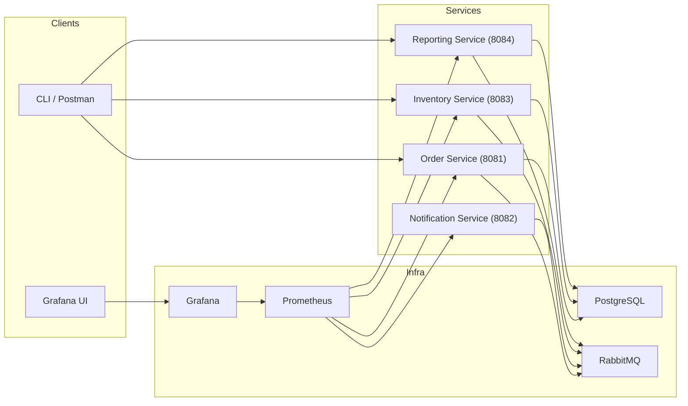

# Runtime Guide (Docker & Local)

This document explains how to bring the Real-Time Order System up with Docker or by
running the services locally. It also points to the relevant metrics and dashboards
you can showcase during a presentation.

## Architecture Overview



## Running Everything via Docker Compose

> Prerequisites: Docker Desktop (or Docker Engine + Compose v2), `make` (optional), and
> an `.env` file (already provided under `deploy/.env`).

1. **Copy / Adjust env file (optional)**
   ```bash
   cd deploy
   cp .env .env.local   # tweak ports or secrets if needed
   ```
2. **Build service images**
   ```bash
   docker compose build order-service notification-service inventory-service reporting-service
   ```
3. **Bring the whole stack up**
   ```bash
   docker compose up -d
   docker compose ps
   ```
4. **Smoke health endpoints**
   ```bash
   curl -s http://localhost:8081/actuator/health
   curl -s http://localhost:8084/actuator/health
   ```
5. **Metrics & dashboards**
   - Prometheus: http://localhost:9090
   - Grafana: http://localhost:3000 (credentials from `GF_SECURITY_ADMIN_USER/PASSWORD` in `deploy/docker-compose.yml`, default `admin` / `admin`)
     - Import dashboards auto-provisioned (`rtos-dashboard` + `reporting-overview`).
   - Reporting metrics: `curl -s http://localhost:8084/actuator/prometheus | head`
6. **Tear down**
   ```bash
   docker compose down -v
   ```

## Running Services Locally (no Docker images)

> This mode is handy during development/presentations where you want code hot-reload.

1. **Start backing services only (Postgres, Rabbit, Observability)**
   ```bash
   cd deploy
   docker compose up -d postgres rabbitmq prometheus grafana
   ```
2. **Install the shared security module**
   ```bash
   cd backend
   ./order-service/mvnw -q -f ../common-security/pom.xml install
   ```
3. **Export shared environment variables**
   ```bash
   export SPRING_PROFILES_ACTIVE=dev
   export POSTGRES_HOST=localhost POSTGRES_PORT=5432 POSTGRES_DB=appdb POSTGRES_USER=app POSTGRES_PASSWORD=app
   export RABBIT_HOST=localhost RABBIT_PORT=5672 RABBIT_USER=rtos RABBIT_PASS=rtos
   export JWT_SECRET="$(grep JWT_SECRET ../deploy/.env | cut -d= -f2-)"
   ```
4. **Run each service via Maven Wrapper**
   ```bash
   cd backend/order-service && ./mvnw spring-boot:run
   # in new terminals
   cd backend/notification-service && ./mvnw spring-boot:run
   cd backend/inventory-service && ./mvnw spring-boot:run
   cd backend/reporting-service && ./mvnw spring-boot:run
   ```
5. **Verify & demo**
   - Use the same curl commands as the Docker flow.
   - Grafana dashboards pick up local services automatically because Prometheus scrapes the containerized targets.

## Metrics & Alerts to Highlight

| KPI / Dashboard | Where to find it | Notes |
|-----------------|------------------|-------|
| Order throughput | Grafana “Reporting Overview” → “Order Events Throughput” panel | Uses `reporting_orders_processed_total` |
| Processing latency | Same dashboard (“Processing Latency” panel) | p90/p99 from histogram |
| Revenue rate | Same dashboard (“Revenue Rate” panel) | Derived from `reporting_order_amount_cents_sum` |
| Prometheus alerts | `deploy/observability/alerts.yml` | Includes service-down, high latency, staleness, queue backlog |

During the presentation you can show:
- `docker compose ps` to prove containers are healthy.
- Grafana panel drill-down links (open `/reports/orders/totals?period=DAILY`).
- Prometheus alert firing by pausing the reporting container to trigger `ReportingServiceDown`.

## Troubleshooting Cheatsheet

- `docker compose logs -f reporting-service`
- `docker exec -it postgres psql -U app appdb -c "select count(*) from report_snapshots;"`
- `docker compose up -d --no-deps reporting-service` (restart a single service)
- If local JVM runs conflict with Docker ports, stop the containers (`docker compose stop order-service ...`) and run the service locally on the same port.
