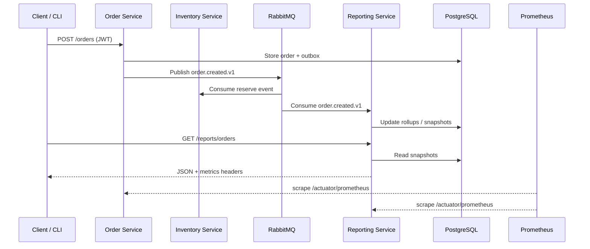

# Runtime Operations – Technical Deep Dive

This companion to `docs/setup/running.md` expands on the architecture, control
flows, operational metrics, and performance validation techniques you can cite
in a technical presentation.

## 1. End-to-End Flow



**Key guarantees**
- Orders enter the system via REST and become events through the outbox pattern.
- Reporting service stays eventually consistent by replaying Rabbit messages and
  refreshing snapshots nightly or on demand.
- Prometheus scrapes every service for Micrometer metrics, enabling SLA tracking.

## 2. Deployment & Process Management

| Mode | Command | Process Control |
|------|---------|-----------------|
| Docker Compose | `docker compose up -d` | `docker compose ps`, `docker compose logs -f reporting-service` |
| Bare JVM | `./mvnw spring-boot:run` in each service dir | `Ctrl+C` to stop, rely on `spring-boot-devtools` for reloads |

**Health & lifecycle**
- Docker healthchecks hit `/actuator/health` every 15 s with a 30 s startup grace.
- To recycle a single service: `docker compose up -d --no-deps reporting-service`.
- Runbook escalation path: check Prometheus alerts, inspect Rabbit queue depth, and
  trigger `/reports/orders/refresh` if lagging.

## 3. Metrics Catalogue

| Metric / Panel | PromQL / Source | Purpose | Baseline |
|----------------|-----------------|---------|----------|
| Order throughput | `rate(reporting_orders_processed_total[5m])` | Event ingest rate | 15–25 orders/min in smoke tests |
| Processing latency | `histogram_quantile(0.95, rate(reporting_order_processing_latency_bucket[5m]))` | p95 lag between event ts and processing | < 2 s |
| Revenue rate | `rate(reporting_order_amount_cents_sum[5m])/100` | Revenue/min (TRY) | Mirrors throughput × order value |
| Staleness | `time() - reporting_last_order_timestamp_seconds` | Seconds since last processed order | < 60 s under load |
| Queue backlog | `rabbitmq_queue_messages_ready{queue="dev.reporting.order-created"}` | Readiness of reporting queue | < 20 |
| Outbox dispatch | `sum(rate(order_outbox_dispatch_total{result="success"}[5m]))` | How many order events flushed from outbox | Should track order throughput |
| Outbox pending gauge | `order_outbox_pending_events` | Gauge maintained by relay; pending events awaiting publish | Ideally 0; investigate if >0 for long |

**Alert thresholds (config in `deploy/observability/alerts.yml`):**
- `ReportingServiceDown`: `up==0` for 1 m.
- `ReportingProcessingLatencyHigh`: p95 > 2 s for 2 m.
- `ReportingStalenessHigh`: no orders for > 5 m.
- `ReportingQueueBacklog`: ready messages > 100 for 5 m.

## 4. Performance Validation Recipe

1. **Seed data**
   ```bash
   DEV_TOKEN="Bearer <paste-dev-token>"
   curl -s -X PUT http://localhost:8083/inventory/ABC-001/adjust \
     -H 'Content-Type: application/json' \
     -H "Authorization: ${DEV_TOKEN}" \
     -d '{"delta": 100, "reason": "demo"}'
   for i in $(seq 1 25); do
     curl -s -X POST http://localhost:8081/orders \
       -H "Authorization: ${DEV_TOKEN}" \
       -H 'Content-Type: application/json' \
       -d "{\"customerId\":\"C-$i\",\"amountCents\":1599,\"currency\":\"TRY\",\"items\":[{\"sku\":\"ABC-001\",\"qty\":1}]}" > /dev/null
   done
   ```
2. **Observe metrics**
   - Prometheus: run the PromQL queries above to confirm throughput/latency.
   - Grafana → Reporting Overview: screenshot the four panels for the presentation.
3. **Trigger alert demo**
   - Stop reporting container: `docker compose stop reporting-service`.
   - Within ~1 minute the `ReportingServiceDown` alert fires in Prometheus.
   - Restart the service and show alert recovery.

## 5. Concrete Outputs

Sample `docker compose ps` (healthy state):
```
NAME                  COMMAND                  STATE     PORTS
order-service         "sh -c 'java …'"         healthy   0.0.0.0:8081->8081/tcp
reporting-service     "sh -c 'java …'"         healthy   0.0.0.0:8084->8084/tcp
prometheus            "/bin/prometheus …"      running   0.0.0.0:9090->9090/tcp
grafana               "/run.sh"                running   0.0.0.0:3000->3000/tcp
```

Sample health probe:
```
$ curl -s http://localhost:8084/actuator/health | jq
{
  "status": "UP",
  "components": {
    "db": { "status": "UP", "details": { "database": "PostgreSQL" } },
    "rabbit": { "status": "UP" }
  }
}
```

## 6. Presentation Tips

- Keep both Grafana dashboards open: general RTOS view + reporting overview.
- Use `docs/setup/running.md` for abbreviated commands on slides; reference this
  document for the “deep dive” appendix.
- Mention the documented release playbook (`docs/containerization/release.md`) to
  show readiness for production deployment even before the Kubernetes phase.
